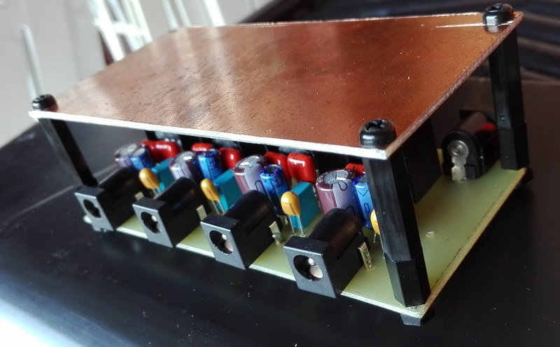
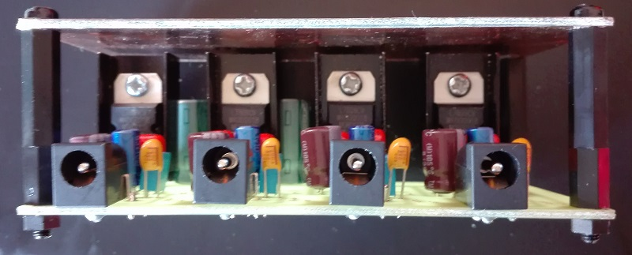
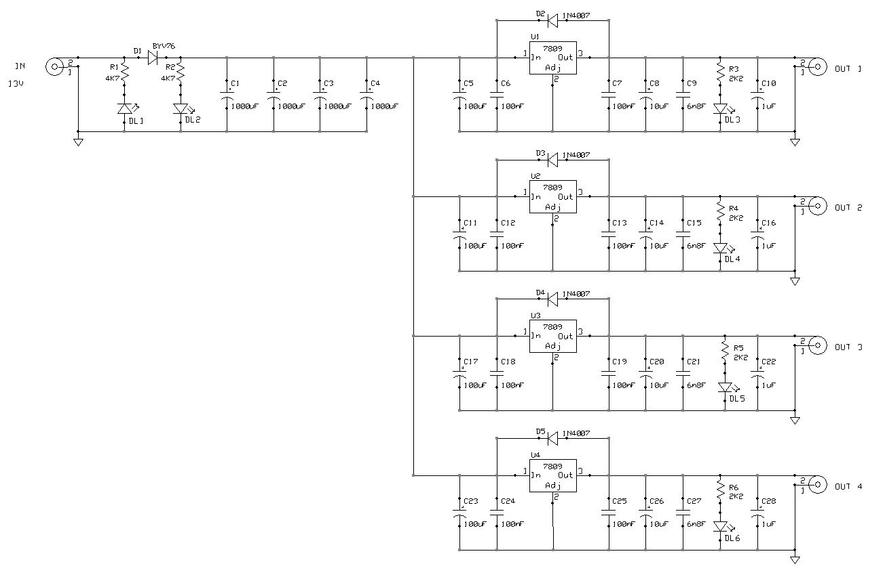
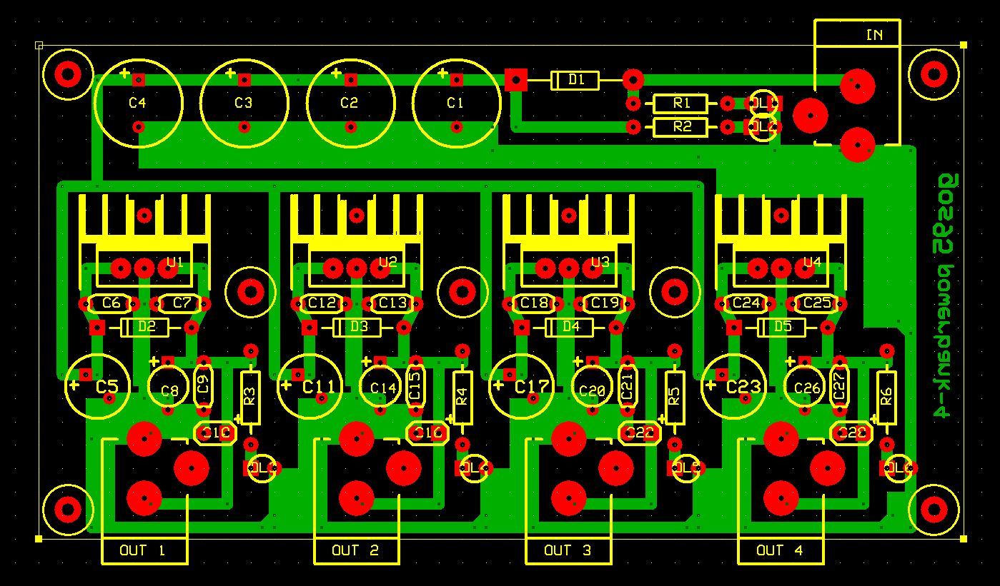

# PowerBANK-4
This is an simple project for a 4-lines power supply (9 volt) bank capable of powering small household devices.

## Specifications

### Features
- 12-15V AC/DC power plug for external input power supply (center-negative)
- Input with polarity test
- 4 isolated and stabilized 9V-250mA center-negative output (common ground)

### Hardware
Schematics and PCB layouts are designed with ExpressPCB free CAD software.

#### Schematic:

#### PCB Layout:

## About
Author : Alessandro Fraschetti (mail: [gos95@gommagomma.net](mailto:gos95@gommagomma.net))

## Licence
This project is under the [MIT license](LICENSE).
You are free to use this for any purpose, just try to give credit in the documentation of your project.
